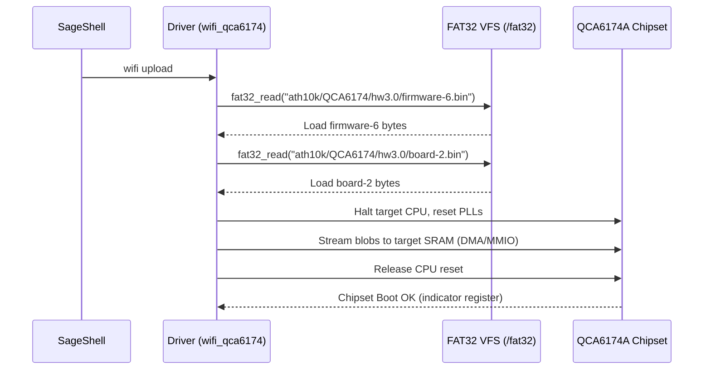

# Qualcomm QCA6174A Wi-Fi Driver Architecture

SageOS features a custom high-performance driver for the **Qualcomm QCA6174A (ath10k family)** M.2 wireless card, which is the default wireless chipset on the **Lenovo 300e Chromebook (2nd Gen AST)**.

The driver is implemented natively in `kernel/drivers/wifi_qca6174.c` with shell-level diagnostics exposed through `kernel/shell/extra_cmds.c`.

---

## 1. Hardware Interface & Discovery

The QCA6174A operates over the PCI Express bus. At system boot:
1. `pci_enumerate()` scans all buses, identifying the card by its Qualcomm Atheros vendor ID and device ID:
   ```c
   #define PCI_VENDOR_QUALCOMM_ATH 0x168C
   #define PCI_DEVICE_QCA6174A     0x003E
   ```
2. The card maps its MMIO register space to **BAR0** (base address register), which is read by the driver for direct register read/write access.
3. Bus Mastering and Memory Write/Invalidate commands are issued to the PCI Command register to allow the Wi-Fi card to issue DMA requests directly to system DRAM.

---

## 2. Firmware Staging Sequence

The Qualcomm Atheros architecture requires loading two distinct firmware blobs into the card's onboard SRAM before the wireless cores can boot:
- **`firmware-6.bin`** — The main operating system and protocol engine of the wireless chipset.
- **`board-2.bin`** — Calibration and RF tuning parameters specific to the Lenovo 300e chassis antenna configuration.

The firmware sequence is initiated via `wifi upload`:



1. **Asset Probing**: Early kernel boot validates the presence of assets in the FAT32 volume.
2. **Chipset Reset**: The chipset is put into a cold-reset state using target PLL controls.
3. **Data Streaming**: The driver copies the loaded binary data from system memory to the device’s memory windows via BAR0.
4. **Boot Verification**: The driver releases target CPU execution and polls target state registers to confirm a successful boot.

---

## 3. Host Ring Configuration (`wifi init-rings`)

Unlike legacy networking cards, modern ath10k chipsets communicate with the host operating system using ring buffers managed by two protocols:
- **WMI** (Wireless Module Interface): Controls, state transitions, authentication requests, and active scan triggers.
- **HTT** (Host-To-Target): High-throughput transmit and receive rings designed for frame encapsulation and DMA data streaming.

Running `wifi init-rings` performs the following steps:
1. Allocates DMA-safe descriptor rings in DRAM for:
   - Target-to-Host Rx Ring
   - Host-to-Target Tx Ring
   - Command/Event Rings
2. Writes physical buffer addresses directly to the card's mailbox registers.
3. Registers the Interrupt Service Routine (ISR) on the MSI (Message Signaled Interrupts) line to process ring events asynchronously.
4. Transitions the `wlan0` interface state to `NET_STATE_READY` in the network subsystem.

---

## 4. Active RF Scanning (`wifi scan`)

When `wifi scan` is triggered:
1. The driver validates that the device has completed ring initialization.
2. It tunes the RF Synthesizer across channels 1, 6, 11 (2.4 GHz) and channel 36 (5 GHz).
3. The driver reads real-time **RTC (Real-Time Clock)** and **PLL** registers via the MMIO space to monitor hardware synchronization state and active synthesizers:
   ```c
   uint32_t rtc_state = qca6174_reg_read(0x00018000 + 0x24);
   ```
4. Broadcast SSIDs are captured via incoming packet frames on the Rx ring and reported back to the shell interface.

---

## 5. Association Supplicant & Handshake (`wifi connect`)

Executing `wifi connect <SSID> <password>` triggers the full supplicant cycle:

1. **WMI v2 Association**: The driver encapsulates an association request with the targeted SSID and sends it over the host-to-target ring.
2. **4-Way Handshake**: 
   - **M1**: The authenticator sends an Anonce (Authenticator Nonce) to the host.
   - **M2**: SageOS derives the **PTK** (Pairwise Transient Key) and **GTK** (Group Temporal Key) using the WPA2-PSK hashing algorithm, generates an Snonce (Supplicant Nonce), and transmits M2 back with a calculated **MIC** (Message Integrity Code).
   - **M3 & M4**: Authentication and encryption keys are verified and finalized.
3. **IP Configuration (DHCP)**: Once associated, a DHCP request is broadcasted on the interface to acquire an IPv4 address, netmask, gateway, and DNS servers.
4. **Credential Persistence (`WIFI.CFG`)**:
   Upon successful connection, the SSID and password are formatted and saved as cleartext configuration inside the `/fat32/WIFI.CFG` file:
   ```
   ssid=MyNetwork
   pass=MyPassword
   ```
   
   To avoid blocking or deadlocking during live VFS cycles, writing credentials bypasses the standard virtual filesystem and uses the low-level `fat32_uefi_write` interface:
   ```c
   int r = fat32_uefi_write("WIFI.CFG", cfg, (size_t)pos);
   ```

At next boot, `qca6174_auto_connect()` reads `/fat32/WIFI.CFG` and automatically attempts association, achieving seamless persistence.

---

## 6. Files & Subsystems

- **`kernel/drivers/wifi_qca6174.c`**: Core driver logic, register MMIO operations, firmware staging, WMI ring setup, and connection supplicant.
- **`kernel/drivers/pci.c`**: Discovery and configuration space setup.
- **`kernel/fs/fat32.c`**: Low-level UEFI-bypassing write interface (`fat32_uefi_write`) for saving configuration profiles.
- **`kernel/shell/extra_cmds.c`**: Front-facing shell execution hooks for `wifi` diagnostic commands.
