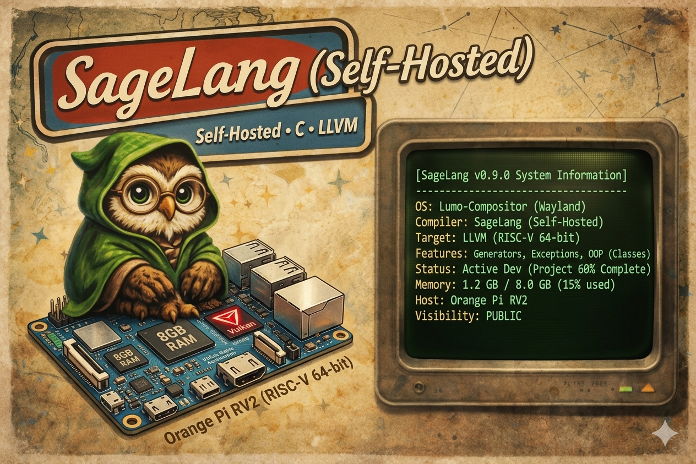
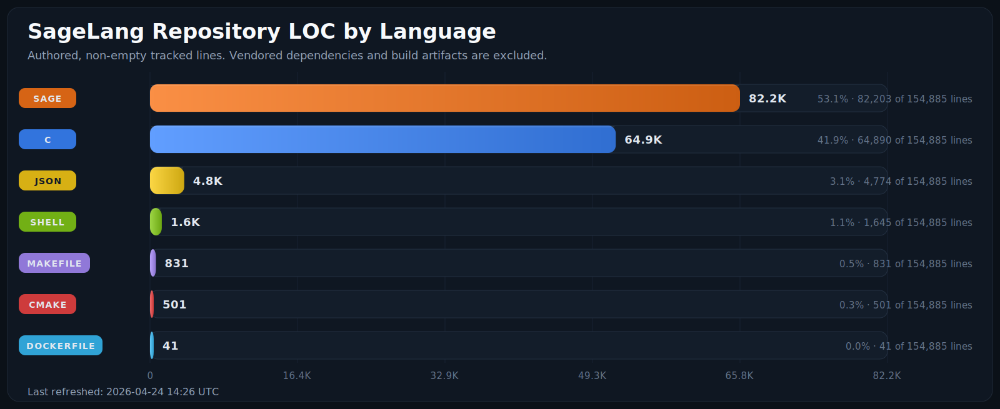
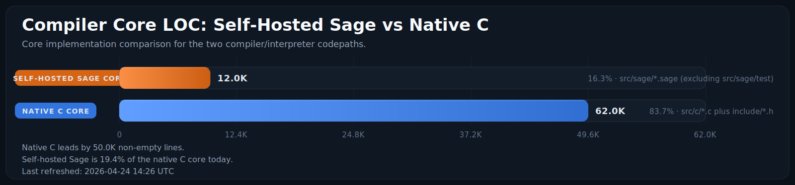
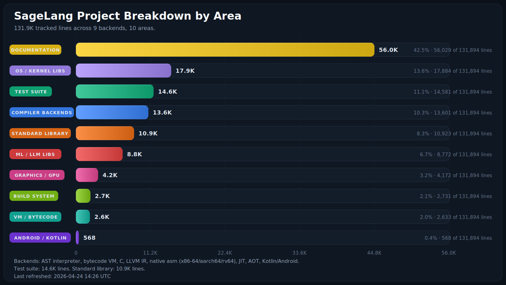
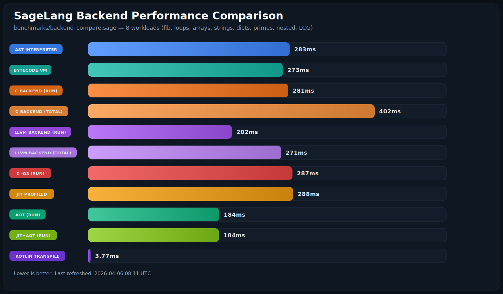
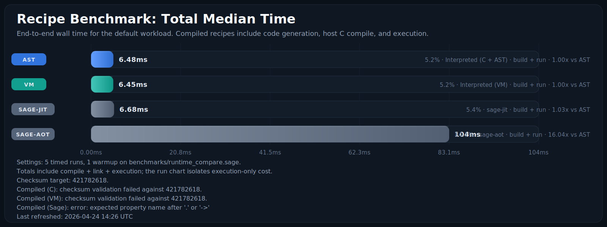
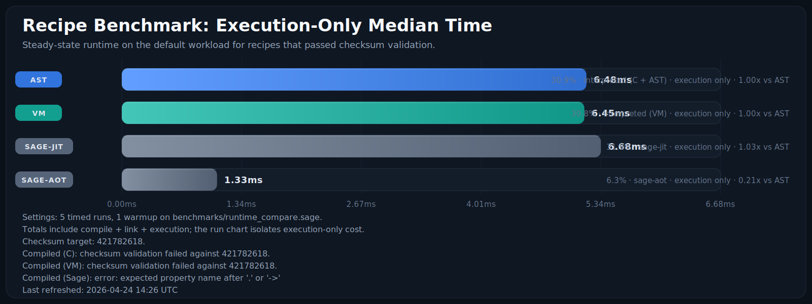

# Sage

**A clean, indentation-based systems programming language built in C.**



Sage is a systems programming language that combines the readability of Python (indentation blocks, clean syntax) with the performance of C. It features ten execution backends (C, LLVM IR, native x86-64/aarch64/rv64, bytecode VM, **SageMetal VM**, JIT, AOT, **Kotlin/Android**), a **self-hosted interpreter** with hybrid JIT/AOT profile-guided type specialization, **Vulkan + OpenGL graphics**, **true atomic operations** and **POSIX semaphores** for multicore concurrency, **SMP/hyperthreading detection**, and **three GC modes** (tracing, ARC, ORC). As of v3.5.4, Sage features structural value equality in uniqueness checks, safe non-hanging string/value repeating, and robust tab/whitespace token checks in sandbox security guards.

## Install (One line installer)

```bash
git clone https://github.com/Night-Traders-Dev/SageLang.git && cd SageLang && chmod +x install.sh && ./install.sh
```

The installer walks you through everything — building, setting up updating, installing dependencies.

### Supported Platforms

| Platform | Package Manager | Notes |
|----------|----------------|-------|
| **Linux** | apt, pacman, dnf, yum, zypper, apk, emerge, xbps | Full support |
| **macOS** | Homebrew or MacPorts | Auto-installs either if needed (pending) |
| **FreeBSD** | pkg | Native BSD-Make support |
| **WSL2** | (same as Linux) | No differences from Linux |

---

## Codebase Metrics

These charts are refreshed by `make charts` and also as part of the default `make` build. They count authored, non-empty tracked lines and exclude vendored dependencies plus generated build artifacts.







## Benchmark Metrics

### Cross-Backend Comparison



Run `python3 scripts/generate_backend_chart.py` or `bash benchmarks/run_backend_compare.sh` to regenerate. Tests 8 workloads (fibonacci, loop sum, arrays, strings, dicts, primes, nested loops, LCG hash) across all native backends.

### Recipe Benchmarks

These charts are also refreshed by `make charts`. They are generated from `python3 scripts/benchmark_recipes.py --runs 5 --warmups 1` against `benchmarks/runtime_compare.sage`, so the absolute timings are machine-specific while the relative shape is the useful signal.

The compiled VM recipe is now charted as a first-class lane on the default workload. Any recipe that still fails or misses checksum validation is called out in the chart footers instead of being drawn as a misleading bar.





### Sage vs Python 3 Benchmarks

Run `make benchmark-python` to compare all Sage execution backends against CPython 3.x on 10 workloads (fibonacci, loop sum, string concat, array ops, dict ops, class methods, nested loops, exceptions, closures, prime sieve).

**Execution backends benchmarked:**
| Backend | Command | Description |
|---------|---------|-------------|
| Python 3 | `python3 file.py` | CPython baseline |
| Sage AST | `sage --runtime ast file.sage` | Tree-walking interpreter (optimized env lookup) |
| Sage VM | `sage --runtime bytecode file.sage` | Bytecode virtual machine |
| Sage C | `sage --compile file.sage -o bin` | C backend compilation |
| Sage LLVM | `sage --compile-llvm file.sage -o bin` | LLVM IR backend |
| Sage JIT | `sage --jit file.sage` | Interpreter + profiling + type feedback |
| Sage AOT | `sage --aot file.sage -o bin` | Type-specialized ahead-of-time compilation |
| Sage JIT+AOT | `sage --aot --jit file.sage -o bin` | Profile-guided AOT compilation |
| Self-Hosted | `sage src/sage/sage.sage file.sage` | Self-hosted with hybrid JIT/AOT profiling |
| Kotlin | `sage --emit-kotlin file.sage -o file.kt` | Kotlin transpilation (emit time) |
| SageMetal | `make metal-vm` | Freestanding bytecode VM for bare-metal kernels |

## 🚀 Features (Implemented)

### Core Language
- **Indentation-based syntax**: No braces `{}` for blocks; just clean, consistent indentation
- **Type System**: Support for **Integers**, **Strings**, **Booleans**, **Nil**, **Arrays**, **Dictionaries**, **Tuples**, **Classes**, **Instances**, **Exceptions**, and **Generators**
- **Functions**: Define functions with `proc name(args):` with full recursion, closures, and first-class function support
- **Control Flow**: `if`/`else`, `while`, `for` loops, `break`, `continue`, **exception handling**, `match`/`case`/`default`, and `defer`
- **Operators**: Arithmetic (`+`, `-`, `*`, `/`), comparison (`==`, `!=`, `>`, `<`, `>=`, `<=`), logical (`and`, `or`), bitwise (`&`, `|`, `^`, `~`, `<<`, `>>`), unary (`-`)

### v2.0 Language Enhancements

- **Type Annotations**: `let x: Int = 42`, `proc add(a: Int, b: Int) -> Int:`, generic types `Array[Int]`, `Dict[String, Int]`
- **Type Checker**: `sage check file.sage` validates annotations against inferred types
- **Struct Declarations**: `struct Point: x: Int, y: Int` with auto-init from constructor args
- **Enum Declarations**: `enum Color: Red, Green, Blue` as tagged variant types
- **Trait Declarations**: `trait Drawable: proc draw(self)` for interface contracts
- **Match Guards**: `case X if condition:` for conditional pattern matching
- **Default Parameters**: `proc connect(host, port=8080):` with flexible arity
- **Multiline Literals**: Arrays, dicts, calls, and proc params across multiple lines with trailing commas
- **String Escape Sequences**: `\n`, `\t`, `\r`, `\\`, `\"`, `\xHH`
- **Hex/Octal Literals**: `0xFF`, `0o755`, `0b1010`
- **Super Auto-Self**: `super.init(name)` instead of `super.init(self, name)`
- **Dunder Hooks**: `__str__` for custom printing, `__eq__` for custom equality
- **Instance Exceptions**: `raise MyError("msg")` with class instances
- **Bytes Type**: Binary-safe `bytes()` with slice, get, set, push operations
- **Unsafe Blocks**: `unsafe:` lexical marker for low-level code
- **Doc Comments**: `## text` stored on functions, retrievable via `doc(fn)`
- **Path Builtins**: `path_join`, `path_dirname`, `path_basename`, `path_ext`, `path_exists`
- **Hash Builtin**: FNV-1a `hash()` for strings, numbers, bytes
- **Conformance Suite**: Cross-backend testing (interpreter, C, LLVM)
- **Stability Policy**: Semantic versioning with formal guarantees (`STABILITY.md`)

### v3.0 Metaprogramming

- **Compile-Time Execution**: `comptime:` blocks and `comptime(expr)` expressions evaluate code during compilation, baking results into the binary as constants
- **Pragmas/Decorators**: `@inline`, `@packed`, `@section("name")`, `@align("N")`, `@deprecated`, `@noreturn` — attach compiler directives to functions and structs
- **AST Macros**: `macro name(params):` defines compile-time code transformers with `quote`/`unquote` support (reserved for future AST manipulation)
- **Generics**: `proc identity[T](x: T) -> T:` and `struct Pair[A, B]:` with bracket-based type parameters for monomorphization in compiled backends

### JIT + AOT Compilers

- **JIT Profiler** (`sage --jit file.sage`): Interpreter with per-function profiling counters and type feedback. Hot functions (100+ calls) are detected; argument types and return types are classified (int, float, string, bool, mixed). Reports profiling data for AOT optimization.
- **AOT Compiler** (`sage --aot file.sage -o binary`): Ahead-of-time compilation with static type inference. Generates self-contained C with type-specialized fast paths for `Int+Int`, `String+String`, and known-type comparisons. Compiles to native binary via `cc -O2`.
- **Combined Mode** (`sage --aot --jit file.sage -o binary`): Profile-guided AOT — runs the program once to collect JIT type feedback, then feeds that data to the AOT compiler for better specialization.
- **Self-Hosted Hybrid**: The self-hosted interpreter (`src/sage/interpreter.sage`) implements its own profile-guided specialization — per-function call counting, monomorphic type tracking, and loop specialization — always-on with no flags needed.

### Exception Handling ✅
- **Try/Catch/Finally**: Full exception handling with `try:`, `catch e:`, and `finally:`
- **Raise Statements**: Throw exceptions with `raise "error message"`, `raise 404`, `raise nil` — any value type is converted to an exception message
- **Exception Propagation**: Exceptions bubble through function calls
- **Finally Blocks**: Cleanup code that always executes; finally control flow (return/break/continue/raise) overrides try/catch result (Python/Java semantics)
- **Nested Exceptions**: Catch and re-raise in nested try blocks
- **Type Safety**: Exception type with message field; GC-tracked message allocation

### Generators & Lazy Evaluation ✅
- **`yield` statements**: Create generator functions for lazy evaluation
- **Iterator protocol**: Use `next(generator)` to get values on-demand
- **Infinite sequences**: Generators can produce unlimited values
- **State preservation**: Generator state persists between `next()` calls
- **Memory efficient**: Only compute values when needed
- **Generator functions**: Automatically detected via `yield` keyword

### Object-Oriented Programming ✅
- **Classes**: `class ClassName:` with full inheritance support
- **Constructors**: `init(self, ...)` method for initialization
- **Methods**: Functions with automatic `self` binding
- **Properties**: Dynamic instance variables via `self.property`
- **Inheritance**: `class Child(Parent):` with method overriding
- **Super calls**: `super.init(...)` / `super.method(...)` — call parent constructors and methods with auto-self; works with deep inheritance chains
- **Arrow operator**: `->` — systems-language style property access, alias for `.`
- **Property Access**: `obj.property` and `obj.property = value`

### Advanced Data Structures
- **Arrays**: Dynamic lists with `push()`, `pop()`, `len()`, and slicing `arr[start:end]`
- **Dictionaries**: Hash maps with `{"key": value}` syntax
- **Tuples**: Immutable sequences `(val1, val2, val3)`
- **Array Slicing**: Pythonic slice syntax for arrays

### Memory Management
- **Garbage Collection**: Concurrent tri-color mark-sweep GC with SATB write barriers for sub-millisecond STW pauses; optional **ARC mode** (`--gc:arc`) for deterministic Nim-style reference counting with cycle detection; optional **ORC mode** (`--gc:orc`) for optimized reference counting with Lins' trial deletion cycle collector — combines ARC's deterministic cleanup with robust cycle detection for complex object graphs
- **ORC Mode** (`--gc:orc`): Nim-inspired Optimized Reference Counting with Lins' trial deletion cycle collector. Recommended for complex object graphs with circular references where sub-millisecond STW pauses are required.
- **Tri-color marking**: white (unreachable), gray (pending scan), black (fully scanned) — objects allocated during marking are born black
- **SATB write barrier**: Snapshot-At-The-Beginning — before overwriting a reference, the old value is shaded gray to prevent the concurrent marker from missing live objects
- **4-phase collection**: Root scan (STW, ~50-200us) -> Concurrent mark -> Remark (STW, ~20-50us) -> Concurrent sweep
- **Full type coverage**: GC properly marks and frees all 16 value types including FFI handles (`VAL_CLIB`), raw pointers (`VAL_POINTER`), threads (`VAL_THREAD`), and mutexes (`VAL_MUTEX`)
- **GC Control**: `gc_collect()`, `gc_enable()`, `gc_disable()`, `gc_set_arc()`, `gc_set_orc()`, `gc_mode()`
- **Statistics**: `gc_stats()` for memory monitoring including STW pause timing
- **Safe**: Prevents use-after-free and memory leaks; external allocations tracked for accurate accounting

### Security Hardening
- **Type-safe value access**: All native functions validate argument types before accessing union members
- **Recursion depth limits**: Statement interpreter guards against stack overflow (max 1000); expression evaluator inlined for zero per-expression overhead
- **Loop iteration limits**: While loops capped at 1M iterations; loop nesting capped at 64 levels
- **Buffer safety**: String literals capped at 4096 chars, identifiers at 1024 chars; all allocation via abort-on-OOM wrappers
- **Shell injection prevention**: Assembly exec/compile paths validate paths and use secure temp files (`mkstemps`)
- **SSL handle safety**: Opaque pointers stored as `VAL_POINTER` (not truncated doubles); double-free prevention via handle nullification
- **Thread safety**: GC mutex protects allocation and collection; environment list operations mutex-protected
- **Signed arithmetic**: String replace and repeat operations use signed math to prevent unsigned underflow/overflow
- **Bitwise safety**: Shift amounts validated 0-63; out-of-range returns 0 instead of C undefined behavior
- **FFI bounds**: ffi_call() validates max 3 arguments; clear error message on excess
- **Memory safety**: mem_read()/mem_write() reject negative offsets; pointer double-free prevention via handle nullification

### String Operations
- **Methods**: `split()`, `join()`, `replace()`, `upper()`, `lower()`, `strip()`
- **Concatenation**: `"Hello" + " World"`
- **Indexing**: Access individual characters
- **Conversion**: `str()` function for number-to-string conversion

### Standard Library (35+ Native Functions)
- **Core**: `print()`, `input()`, `clock()`, `tonumber()`, `str()`, `len()`
- **Arrays**: `push()`, `pop()`, `range()`, `slice()`
- **Strings**: `split()`, `join()`, `replace()`, `upper()`, `lower()`, `strip()`
- **Dictionaries**: `dict_keys()`, `dict_values()`, `dict_has()`, `dict_delete()`
- **GC**: `gc_collect()`, `gc_stats()`, `gc_enable()`, `gc_disable()`
- **Generators**: `next()` for iterator protocol
- **FFI**: `ffi_open()`, `ffi_call()`, `ffi_close()`, `ffi_sym()`
- **Memory**: `mem_alloc()`, `mem_free()`, `mem_read()`, `mem_write()`, `mem_size()`, `addressof()`
- **Assembly**: `asm_exec()`, `asm_compile()`, `asm_arch()` (x86-64, aarch64, rv64)
- **Structs**: `struct_def()`, `struct_new()`, `struct_get()`, `struct_set()`, `struct_size()`

### Concurrency & Async/Await

- **Threads**: `thread.spawn()`, `thread.join()`, `thread.mutex()`, `thread.lock()`, `thread.unlock()`, `thread.sleep()`, `thread.id()`
- **Async Procs**: `async proc name():` spawns work on a new thread when called
- **Await**: `await future` joins the thread and returns the result
- **True Atomics**: `atomic_new(init)`, `atomic_load(a)`, `atomic_store(a,v)`, `atomic_add(a,v)`, `atomic_cas(a,exp,des)`, `atomic_exchange(a,v)` — C-level `__atomic` builtins, safe for concurrent access
- **POSIX Semaphores**: `sem_new(permits)`, `sem_wait(s)`, `sem_post(s)`, `sem_trywait(s)` — real blocking semaphores
- **Condition Variables**: `sage_cond_wait()`, `sage_cond_signal()`, `sage_cond_broadcast()` — C-level pthread_cond_t
- **Read-Write Locks**: `sage_rwlock_rdlock()`, `sage_rwlock_wrlock()` — concurrent readers, exclusive writers
- **SMP/Multicore Detection**: `cpu_count()`, `cpu_physical_cores()`, `cpu_has_hyperthreading()`
- **Core Affinity**: `thread_set_affinity(core_id)`, `thread_get_core()`
- **Thread Safety**: GC mutex for safe concurrent memory management

### Native Standard Library Modules

- **`math`**: 25 functions + 5 constants (sin, cos, tan, sqrt, pow, log, floor, ceil, round, abs, pi, e, inf, tau, etc.)
- **`io`**: File operations (readfile, writefile, appendfile, exists, remove, isdir, filesize)
- **`string`**: String utilities (find, rfind, startswith, endswith, contains, char_at, ord, chr, repeat, count, substr, reverse)
- **`sys`**: System info (args, exit, getenv, clock, sleep, version, platform)
- **`thread`**: Threading primitives (spawn, join, mutex, lock, unlock, sleep, id)
- **`fat`**: FAT boot sector parsing + layout math (FAT8/FAT12/FAT16/FAT32 detection, `cluster_to_lba`, FAT entry offsets) — now in `lib/os/`, imported as `import os.fat`

### Networking Modules

- **`socket`**: Low-level POSIX sockets (create, bind, listen, accept, connect, send, recv, sendto, recvfrom, close, setopt, poll, resolve, nonblock) with constants (AF_INET, AF_INET6, SOCK_STREAM, SOCK_DGRAM, SOCK_RAW, IPPROTO_TCP, IPPROTO_UDP)
- **`tcp`**: High-level TCP (connect, listen, accept, send, recv, sendall, recvall, recvline, close)
- **`http`**: HTTP/HTTPS client via libcurl (get, post, put, delete, patch, head, download, escape, unescape) — returns `{status, body, headers}` dicts with options for timeout, redirects, SSL verification, custom headers
- **`ssl`**: OpenSSL bindings (context, load_cert, wrap, connect, accept, send, recv, shutdown, free, free_context, error, peer_cert, set_verify)

### OS Development Libraries (`lib/os/`)

SageLang ships with 44 binary format parsers, hardware abstraction, boot, kernel, filesystem, image, Linux kernel support, and QEMU virtualization modules for bare-metal, UEFI, and OS kernel development. All modules live under `lib/os/` and are imported with dotted paths:

| Module | Import | Description |
|--------|--------|-------------|
| **FAT** | `import os.fat` | FAT8/12/16/32 boot sector parser, cluster-to-LBA, FAT entry offsets |
| **FAT Dir** | `import os.fat_dir` | FAT directory traversal, file reading, path resolution, cluster chain walking |
| **ELF** | `import os.elf` | ELF32/64 header, program/section headers, string table, section lookup |
| **MBR** | `import os.mbr` | MBR partition table, CHS decode, bootable partition finder |
| **GPT** | `import os.gpt` | GPT header, GUID parsing, partition type identification |
| **PE/COFF** | `import os.pe` | DOS/COFF/optional headers, section parsing, UEFI app detection |
| **PCI** | `import os.pci` | PCI config space (Type 0/1), BAR decode, capability lists, BDF addressing |
| **UEFI** | `import os.uefi` | EFI memory map, config tables, RSDP, ACPI SDT headers |
| **ACPI** | `import os.acpi` | MADT (APIC), FADT, HPET, MCFG parsers, processor enumeration |
| **Paging** | `import os.paging` | x86-64 page table entries, index extraction, identity/higher-half mapping |
| **IDT** | `import os.idt` | x86-64 interrupt descriptor table, gate construction, PIC remapping |
| **Serial** | `import os.serial` | UART/COM port configuration, initialization sequences, debug output |
| **DTB** | `import os.dtb` | Flattened Device Tree parser for ARM64/RISC-V platforms |
| **Alloc** | `import os.alloc` | Bump, free-list, and bitmap page allocators for kernel heaps |
| **VFS** | `import os.vfs` | Virtual filesystem abstraction layer with pluggable backends |
| **ext** | `import os.ext` | ext2/3/4 filesystem: superblock, inode table, directory entries, extent tree |
| **btrfs** | `import os.btrfs` | Btrfs superblock, chunk tree, root tree, subvolumes, checksums |
| **f2fs** | `import os.f2fs` | F2FS superblock, checkpoint, segment info, node/data addressing |
| **multiboot** | `import os.boot.multiboot` | Multiboot2 header generation, tag building, boot info parsing |
| **gdt** | `import os.boot.gdt` | x86_64 GDT descriptor construction, TSS entries, LGDT sequence |
| **start** | `import os.boot.start` | Boot assembly generation (x86_64 multiboot + long mode, aarch64, riscv64) |
| **build** | `import os.boot.build` | Build pipeline: serial drivers, kernel templates, QEMU commands (all 3 archs) |
| **linker** | `import os.boot.linker` | Linker script generation for bare-metal ELF kernels (all 3 archs) |
| **kmain** | `import os.kernel.kmain` | Kernel entry point scaffolding, boot info handoff |
| **console** | `import os.kernel.console` | VGA text-mode console (80×25, color attributes, scrolling) |
| **keyboard** | `import os.kernel.keyboard` | PS/2 keyboard driver (scancode set 2, key event dispatch) |
| **timer** | `import os.kernel.timer` | PIT channel 0 timer, IRQ0 handler, millisecond tick counter |
| **syscall** | `import os.kernel.syscall` | SYSCALL/SYSRET dispatch table, argument marshalling |
| **pmm** | `import os.kernel.pmm` | Physical memory manager (bitmap allocator, multiboot2 memory map) |
| **vmm** | `import os.kernel.vmm` | Virtual memory manager (4-level paging, map/unmap, page fault handler) |
| **diskimg** | `import os.image.diskimg` | Bootable disk image builder (.img: MBR + FAT partition + kernel) |
| **iso** | `import os.image.iso` | ISO 9660 image creation (El Torito bootable CD/DVD) |
| **syscalls** | `import os.linux.syscalls` | Linux syscall interface (x86_64/aarch64/rv64) |
| **driver** | `import os.linux.driver` | Linux kernel driver framework (char/block/net device C codegen) |
| **kmodule** | `import os.linux.kmodule` | Kernel module builder (C codegen, DKMS, Kbuild, procfs) |
| **procfs** | `import os.linux.procfs` | /proc filesystem reader (cpuinfo, meminfo, loadavg, uptime) |
| **netlink** | `import os.linux.netlink` | Netlink socket message builder/parser |
| **sysfs** | `import os.linux.sysfs` | /sys filesystem reader (block/net/cpu/thermal/power devices) |
| **devicetree** | `import os.linux.devicetree` | Device Tree overlay builder (DTS codegen) |
| **cgroups** | `import os.linux.cgroups` | Control Groups v2 interface |
| **epoll** | `import os.linux.epoll` | epoll event loop builder (C codegen) |
| **ioctl** | `import os.linux.ioctl` | ioctl command builder (_IO/_IOR/_IOW/_IOWR) |
| **namespace** | `import os.linux.namespace` | Linux namespaces for containerization |
| **qemu** | `import os.qemu` | QEMU VM launcher (x86_64/aarch64/riscv64, KVM, drives, networking, GDB, presets) |
| **qemu_run** | `import os.linux.qemu_run` | Kernel module test runner (automated QEMU test pipelines, init script gen, result parsing) |
| **Metal Core**| `import metal.core` | Bare-metal stubs: puts, putchar, inb/outb, mmio, cli/sti/hlt, panic |
| **Metal Serial**| `import metal.serial` | NS16550A/PL011 drivers, baud rate validation, timeout-aware reads, line reading, buffer flushing |
| **Metal GPIO** | `import metal.gpio` | MMIO-based GPIO, pin modes, pull config, interrupts, batch mask-based operations |
| **Metal IRQ**  | `import metal.irq` | Interrupt registration, priority levels, nesting depth tracking, arch-neutral masking |
| **Metal Timer**| `import metal.timer` | x86 PIT (periodic/one-shot), hardware latching remaining time, IRQ-safe cancellation |

- **Discord Bot Library**: Gateway API and REST API support for building Discord bots, designed to mirror the familiarity of Python's `discord` and `discord.ext` libraries.


**Bare-metal C runtime**: `src/c/bare_metal.c` provides a freestanding runtime (no libc) used by `--compile-bare` and `--compile-uefi` — supplies `memcpy`, `memset`, `memcmp`, basic integer formatting, and panic handler.

**Boot → Kernel → QEMU** example (builds and runs on all three architectures):

```sage
# Generate a bootable x86_64 kernel that prints to serial
gc_disable()
import io
import os.boot.start as start
import os.boot.build as build

let asm = start.generate_boot_asm_mb1("Hello from SageOS!")
let ld = build.generate_linker_x86_mb1()
io.writefile("boot.S", asm)
io.writefile("linker.ld", ld)
# as --32 -o boot.o boot.S && ld -m elf_i386 -T linker.ld -o kernel.elf boot.o
# qemu-system-x86_64 -m 128M -display none -serial mon:stdio -kernel kernel.elf
```

```sage
# Generate an aarch64 kernel (PL011 UART on QEMU virt)
let asm = start.emit_start_aarch64("kmain", "stack_top")
asm = asm + build.generate_serial_boot_aarch64()
let kernel_c = build.generate_kernel_c("aarch64", "Hello from SageOS!")
# aarch64-linux-gnu-as -o boot.o boot.S
# aarch64-linux-gnu-gcc -ffreestanding -nostdlib -c -o kernel.o kernel.c
# aarch64-linux-gnu-ld -T linker.ld -o kernel.elf boot.o kernel.o
# qemu-system-aarch64 -machine virt -cpu cortex-a57 -m 128M -display none -serial mon:stdio -kernel kernel.elf
```

```sage
# Generate a riscv64 kernel (NS16550 UART on QEMU virt)
let asm = start.emit_start_riscv64("kmain", "stack_top")
asm = asm + build.generate_serial_boot_riscv64()
let kernel_c = build.generate_kernel_c("riscv64", "Hello from SageOS!")
# riscv64-linux-gnu-as -march=rv64gc -mabi=lp64d -o boot.o boot.S
# riscv64-linux-gnu-gcc -ffreestanding -nostdlib -march=rv64gc -mabi=lp64d -c -o kernel.o kernel.c
# riscv64-linux-gnu-ld -T linker.ld -o kernel.elf boot.o kernel.o
# qemu-system-riscv64 -machine virt -m 128M -display none -serial mon:stdio -bios none -kernel kernel.elf
```

Binary format parsing example:
```sage
import os.fat
import io

let boot = io.readbytes("disk.img")
let info = fat.parse_boot_sector(boot)
print info["fat_type"]        # FAT12 / FAT16 / FAT32 / FAT8

import os.elf
let binary = io.readbytes("kernel.elf")
let hdr = elf.parse_header(binary)
print hdr["machine_name"]    # x86_64
```

### Networking Libraries (`lib/net/`)

High-level networking utilities built on top of the native `socket`, `tcp`, `http`, and `ssl` modules. All imported with `net.` prefix:

| Module | Import | Description |
|--------|--------|-------------|
| **URL** | `import net.url` | URL parsing/building, percent-encoding/decoding, query string handling |
| **Headers** | `import net.headers` | HTTP header parsing/building, content-type inspection, constants |
| **Request** | `import net.request` | HTTP request builder with fluent API, auth helpers, response status utilities |
| **Server** | `import net.server` | TCP/HTTP server framework with routing, request parsing, response builders |
| **WebSocket** | `import net.websocket` | WebSocket frame building/parsing (RFC 6455), upgrade handshake |
| **MIME** | `import net.mime` | MIME type lookup from file extensions (80+ types), category classification |
| **DNS** | `import net.dns` | DNS wire-format message parsing/building, query construction, name compression |
| **IP** | `import net.ip` | IPv4 parsing/validation, CIDR subnets, private/loopback/multicast checks |

Example:
```sage
import net.url
import net.ip

let u = url.parse("https://api.example.com:8443/v1/users?page=2")
print u["host"]      # api.example.com
print u["port"]      # 8443
print u["path"]      # /v1/users

let params = url.parse_query(u["query"])
print params["page"] # 2

print ip.is_private("192.168.1.1")  # true
let cidr = ip.parse_cidr("10.0.0.0/8")
print cidr["host_count"]            # 16777214

import net.server
proc hello_handler(req):
    return server.response_json("{" + chr(34) + "msg" + chr(34) + ": " + chr(34) + "hello" + chr(34) + "}")

let srv = server.create_server("0.0.0.0", 8080)
server.get_route(srv["router"], "/", hello_handler)
# server.listen_and_serve(srv)  # blocking
```

### GPU Graphics Engine (Vulkan + OpenGL)

- **`gpu`**: Full Vulkan backend with handle-based resource management
  - Context: `gpu.initialize(name, validation?)`, `gpu.shutdown()`, `gpu.device_name()`, `gpu.device_limits()`
  - Buffers: `gpu.create_buffer()`, `gpu.buffer_upload()`, `gpu.buffer_download()`, `gpu.destroy_buffer()`
  - Images: `gpu.create_image()` (1D/2D/3D, 13 formats), auto image view creation
  - Samplers: `gpu.create_sampler()` with filter and address mode control
  - Shaders: `gpu.load_shader()` for SPIR-V modules, `gpu.load_shader_glsl()` for OpenGL GLSL
  - Descriptors: layout creation, pool allocation, buffer/image/sampler binding
  - Compute pipelines: `gpu.create_compute_pipeline()`, `gpu.cmd_dispatch()`
  - Graphics pipelines: full config (vertex input, rasterization, blend, depth, topology)
  - Render passes & framebuffers: attachment config with auto depth detection
  - Commands: record, bind, dispatch, draw, barriers, copy operations
  - Synchronization: fences, semaphores, queue submission (graphics + compute)
  - 100+ Vulkan enum constants exported
  - Auto-detected via pkg-config; compiles as stubs without Vulkan SDK
- **OpenGL Backend**: `SAGE_HAS_OPENGL` auto-detected, OpenGL 4.5+ core profile via GLFW
  - `lib/opengl.sage`: Drop-in replacement for Vulkan path (`import opengl` instead of `import gpu`)
  - Same handle-based API — games can switch backends by changing one import
  - Direct GLSL shader support alongside SPIR-V
- **LLVM-Compiled GPU Support**: `sage --compile-llvm` produces native executables with full GPU access
  - 103 `sage_rt_gpu_*` bridge functions in the LLVM runtime
  - GPU constants (for example `from gpu import BUFFER_STORAGE`) resolved at compile time (no runtime lookup overhead)
  - Automatic linking against Vulkan, GLFW, and OpenGL libraries
  - Pure C GPU API layer (`gpu_api.h/gpu_api.c`) shared between interpreter and compiled paths
- **Bytecode VM GPU Opcodes**: 30 dedicated opcodes for frame-loop hot paths
  - Direct C calls for `poll_events`, `key_pressed`, `cmd_draw`, `submit_with_sync`, etc.
  - Bypasses interpreter overhead for real-time rendering loops
- **`lib/vulkan.sage`**: Ergonomic builder API — `vulkan.buffer("storage")`, `vulkan.shader("compute.spv", "compute")`
- **`lib/gpu.sage`**: High-level helpers — `run_compute()` for one-shot GPU compute, ping-pong buffers, device info
- **Rendering Libraries** (`lib/graphics/`): `math3d` (vectors/matrices/camera), `mesh` (procedural cube/plane/sphere, OBJ), `renderer` (frame loop), `material` (shader+texture binding), `scene` (scene graph), `pbr` (Cook-Torrance materials), `postprocess` (HDR/bloom/tonemapping), `shadows` (cascade shadow maps), `deferred` (G-buffer, SSAO, SSR), `taa` (temporal anti-aliasing), `gltf` (glTF 2.0 loading), `asset_cache`, `frame_graph`, `debug_ui`, `ui` (immediate-mode widgets) — imported with `graphics.` prefix (e.g., `from graphics.math3d import vec3`)

### JSON Library (cJSON Port)

- **`lib/json.sage`**: Complete 1:1 port of Dave Gamble's [cJSON](https://github.com/DaveGamble/cJSON) library (~1,050 lines)
- Full API: `cJSON_Parse`, `cJSON_Print`, `cJSON_PrintUnformatted`, `cJSON_Create*`, `cJSON_Get*`, `cJSON_Is*`, `cJSON_Add*ToObject`, `cJSON_Duplicate`, `cJSON_Compare`, `cJSON_Minify`
- Array/object manipulation: insert, detach, delete, replace items
- Sage-native conversion: `cJSON_ToSage` (tree→native dict/array), `cJSON_FromSage` (native→tree)
- 88 tests passing

Example:
```sage
import math
print math.sqrt(16)    # 4
print math.pi          # 3.14159...

import http
let resp = http.get("https://example.com")
print resp["status"]   # 200

from json import cJSON_Parse, cJSON_Print, cJSON_ToSage
let root = cJSON_Parse(resp["body"])
let native = cJSON_ToSage(root)

async proc compute(x):
    return x * x

let future = compute(42)
print await future     # 1764

import gpu
gpu.initialize("My App", true)
print gpu.device_name()
let buf = gpu.create_buffer(1024, gpu.BUFFER_STORAGE, gpu.MEMORY_HOST_VISIBLE | gpu.MEMORY_HOST_COHERENT)
gpu.buffer_upload(buf, [1.0, 2.0, 3.0, 4.0])
gpu.shutdown()
```

### Developer Tooling

- **REPL**: `sage` (no args) or `sage --repl` for interactive development with multi-line blocks, error recovery, and built-in commands such as `:help`, `:vars`, `:type`, `:doc`, `:edit`, `:ls`, `:cat`, `:sh`, `:search`, `:clear-history`, `:load`, `:reset`, `:pwd`, `:cd`, and `:gc`
- **Formatter**: `sage fmt <file>` formats in place, `sage fmt --check <file>` checks without modifying
- **Linter**: `sage lint <file>` with expanded rules (E001-E003 errors, W001-W005 warnings, S001-S005 style)
- **Syntax Highlighting**: TextMate grammar (`editors/sage.tmLanguage.json`), VSCode extension (`editors/vscode/`)
- **LSP Server**: `sage --lsp` or standalone `sage-lsp` binary with diagnostics, completion, hover (including user-defined docstrings), formatting

### Self-Hosting / Bootstrap

Sage can run Sage programs through a self-hosted interpreter written entirely in SageLang. The lexer, parser, interpreter, and full compiler toolchain have been ported from C to Sage.

```bash
cd src/sage && ../../sage sage.sage program.sage
```

- **Lexer** (`lexer.sage`, ~300 lines) - Indentation-aware tokenizer with dict-based keyword lookup
- **Parser** (`parser.sage`, ~700 lines) - Recursive descent with 12 precedence levels
- **Interpreter** (`interpreter.sage`, ~1050 lines) - Tree-walking evaluator with dict-based values
- **Bootstrap coverage**: arithmetic, variables, control flow, functions, recursion, closures, classes, inheritance, arrays, dicts, strings, try/catch, break/continue, bitwise operators (~), module imports, loop iteration limits
- **Module imports**: `import X`, `import X as Y`, `from X import a, b` with module caching and multi-path search (`./`, `lib/`)
- **LLVM constant imports (C backend + self-hosted LLVM backend)**: `from X import Y` now resolves foldable top-level `let` constants across modules at compile time (with alias support via `from X import Y as Z`)
- **Self-hosted test suites**: lexer, parser, interpreter, bootstrap, formatter, linter, value, optimization passes, stdlib, module loading, codegen, compiler, LSP, and CLI coverage
- GC must be disabled for self-hosted code (`gc_disable()`)

### Bundled `lib/` Modules

The standard library is organized into subdirectories with dotted import paths:

**General-purpose** (`lib/`, imported directly):
- **`math`**: arithmetic helpers, `pow_int`, `factorial`, `gcd`, `lcm`, `sqrt`, distance helpers
- **`arrays`**: `map`, `filter`, `reduce`, `unique`, `zip`, `chunk`, `flatten`, `concat`
- **`strings`**: whitespace cleanup, `contains`, substring counting, padding, case formatting helpers
- **`dicts`**: query-oriented helpers for dictionary size, fallback reads, entries, and key checks
- **`iter`**: reusable generators such as `count`, `range_step`, `enumerate_array`, `cycle`, and `take`
- **`stats`**: `mean`, `variance`, `stddev`, `cumulative`, and normalization helpers
- **`assert`**: assertion helpers for writing Sage test scripts
- **`utils`**: general helpers like `default_if_nil`, `swap`, `head`, `last`, and `repeat_value`
- **`json`**: Complete 1:1 cJSON port — parse, print, create, query, modify JSON trees (88 tests)

**Graphics** (`lib/graphics/`, imported as `import graphics.<module>`):
- **`vulkan`**: Ergonomic Vulkan builder API (string-based buffer/shader/pipeline creation, barrier helpers)
- **`gpu`**: High-level GPU compute helpers (one-shot compute dispatch, ping-pong buffers, device info)
- **`opengl`**: OpenGL backend wrapper (drop-in replacement for Vulkan, same API with OpenGL 4.5 init)
- **`ui`**: Immediate-mode GPU UI widgets (windows, panels, buttons, labels, menus, scrollbars, checkboxes, sliders, text inputs, tooltips, progress bars)
- **`math3d`**, **`mesh`**, **`renderer`**, **`camera`**, **`scene`**, **`material`**, **`pbr`**, **`postprocess`**, **`shadows`**, **`deferred`**, **`taa`**, **`gltf`**, **`asset_cache`**, **`frame_graph`**, **`debug_ui`**

**OS / Bare-metal** (`lib/os/`, imported as `import os.<module>`) — 44 modules:

- **`fat`**, **`fat_dir`**, **`elf`**, **`mbr`**, **`gpt`**, **`pe`**, **`pci`**, **`uefi`**, **`acpi`**, **`paging`**, **`idt`**, **`serial`**, **`dtb`**, **`alloc`**, **`vfs`** (15 core)
- **Filesystems**: **`ext`** (ext2/3/4), **`btrfs`**, **`f2fs`** (3)
- **Boot** (`lib/os/boot/`): **`multiboot`**, **`gdt`**, **`start`** (x86_64 asm gen), **`linker`** (4)
- **Kernel** (`lib/os/kernel/`): **`kmain`**, **`console`** (VGA), **`keyboard`** (PS/2), **`timer`** (PIT), **`syscall`**, **`pmm`**, **`vmm`** (7)
- **Image** (`lib/os/image/`): **`diskimg`** (bootable .img builder), **`iso`** (ISO 9660) (2)
- **Linux** (`lib/os/linux/`): **`syscalls`**, **`driver`**, **`kmodule`**, **`procfs`**, **`netlink`**, **`sysfs`**, **`devicetree`**, **`cgroups`**, **`epoll`**, **`ioctl`**, **`namespace`**, **`qemu_run`** (12)
- **QEMU** (`lib/os/`): **`qemu`** (VM launcher with machine presets, drives, networking, GDB) (1)

**Networking** (`lib/net/`, imported as `import net.<module>`):
- **`url`**: URL parsing, building, percent-encoding/decoding, query string handling
- **`headers`**: HTTP header parsing/building, content-type inspection, header constants
- **`request`**: HTTP request builder with fluent API, auth helpers, response classification
- **`server`**: TCP/HTTP server framework with request parsing, router, response builders
- **`websocket`**: WebSocket frame building/parsing (RFC 6455), upgrade handshake helpers
- **`mime`**: MIME type lookup from file extensions (80+ types), category classification
- **`dns`**: DNS wire-format message parsing/building, record types, name compression
- **`ip`**: IPv4 parsing/validation, CIDR subnets, private/loopback/multicast detection

**Cryptography** (`lib/crypto/`, imported as `import crypto.<module>`):
- **`hash`**: SHA-256, SHA-1, CRC-32 pure Sage implementations with hex output
- **`hmac`**: HMAC (RFC 2104) with pluggable hash functions, constant-time comparison
- **`encoding`**: Base64 (standard + URL-safe), hex encoding/decoding
- **`cipher`**: XOR cipher, RC4 stream cipher, PKCS#7 padding, CBC/CTR mode helpers
- **`rand`**: xoshiro256** PRNG, UUID v4, random bytes/strings/hex, Fisher-Yates shuffle
- **`password`**: PBKDF2-HMAC key derivation, password hashing/verification

**Machine Learning** (`lib/ml/`, imported as `import ml.<module>`):
- **`tensor`**: N-dimensional tensors with shape tracking, element-wise ops, matmul, reductions, activations (ReLU, sigmoid, softmax), broadcasting
- **`nn`**: Neural network layers (Linear, ReLU, Sigmoid, Tanh, Dropout, BatchNorm), Sequential model, parameter collection
- **`optim`**: SGD (with momentum), Adam optimizer, learning rate schedulers (step, exponential, cosine, warmup)
- **`loss`**: MSE, cross-entropy, binary cross-entropy, Huber, L1, hinge, KL divergence with gradient functions
- **`data`**: Dataset/DataLoader, batching, shuffling, normalization, min-max scaling, one-hot encoding, train/test split
- **`debug`**: Weight stats, histograms, activation analysis, gradient checking, training diagnostics, attention patterns
- **`viz`**: SVG chart generation (loss curves, weight distributions, attention heatmaps, architecture diagrams, LR schedules, HTML dashboard)
- **`monitor`**: Live training monitor with progress bars, memory snapshots, throughput tracking, checkpoint management
- **`gpu_accel`**: GPU-accelerated ML ops with CPU fallback (matmul, RMSNorm, SiLU, softmax via compute shaders), transformer layer/model forward helpers, GLSL shader templates
- **`npu`**: NPU backend for Qualcomm Hexagon (Snapdragon SNPE), Samsung Exynos (ONE), NNAPI, and ARM NEON SIMD fallback; model format conversion (`to_nnapi_format`, `to_one_format`, `to_snpe_format`)

**CUDA** (`lib/cuda/`, imported as `import cuda.<module>`):
- **`device`**: GPU device descriptors, compute capability, architecture detection, feature checks, launch configuration
- **`memory`**: GPU memory allocation, typed tensors, host/device transfers, memory pools, bandwidth estimation
- **`kernel`**: Kernel definition, 1D/2D/3D launch parameters, occupancy analysis, common kernel patterns
- **`stream`**: CUDA streams, events, timing, multi-stream execution plans, double-buffered pipeline

**Standard Library** (`lib/std/`, imported as `import std.<module>`):
- **`regex`**: Regular expression engine (`.`, `*`, `+`, `?`, `[]`, `^`, `$`, `\d`, `\w`, `\s`), search/match/replace/split
- **`datetime`**: Date/time creation, ISO 8601 formatting/parsing, arithmetic, comparison, weekday
- **`log`**: Structured logging (TRACE-FATAL), handlers, child loggers, field context
- **`argparse`**: CLI argument parser (flags, options, positionals), help text generation
- **`compress`**: RLE, LZ77, delta encoding/decoding with round-trip support
- **`process`**: Process/environment utilities, path manipulation, exit codes, timers
- **`unicode`**: UTF-8 encoding/decoding, character classification, case conversion, string trim/center/reverse
- **`fmt`**: String formatting (hex, binary, octal, comma-separated integers, percentages, byte sizes, duration), template engine, table formatting
- **`testing`**: Test suite runner with assertions (equal, contains, raises, close), benchmarking
- **`enum`**: Enumerations, tagged unions (ADT), Result (Ok/Err), Option (Some/None) with map/unwrap
- **`trait`**: Interface/trait system, behavioral contracts, type checking, sort/filter/map utilities
- **`signal`**: Event bus (publish-subscribe), on/once/emit/off, atexit handlers
- **`db`**: In-memory database (tables, CRUD, select/update/delete, joins, group_by, aggregation, pagination)
- **`channel`**: Go-style buffered channels, send/recv/select, fan-out/fan-in, drain
- **`threadpool`**: Work queue, task submission, parallel map, futures/promises
- **`atomic`**: Atomic integers (load/store/CAS/exchange), atomic flags, spin locks, counters
- **`rwlock`**: Read-write locks (multiple readers OR one writer), scoped lock helpers
- **`condvar`**: Condition variables, barriers, latches, semaphores
- **`debug`**: Value inspection, trace logging, watch expressions, memory snapshots
- **`profiler`**: Hierarchical timing, call counting, hotspot detection, benchmark runner
- **`docgen`**: Documentation extraction from source comments, markdown generation
- **`build`**: Project configuration, dependency declaration, semver parsing, build targets
- **`interop`**: FFI helpers, C type constants, struct definition, pack/unpack, platform detection

**LLM / Neural Networks** (`lib/llm/`, imported as `import llm.<module>`):
- **`config`**: Model configurations (tiny to Llama-13B), parameter counting, memory estimation
- **`tokenizer`**: Character, word, and BPE tokenizers with train/encode/decode
- **`embedding`**: Token embeddings, sinusoidal/learned/RoPE positional encodings
- **`attention`**: Multi-head self-attention, scaled dot-product, KV cache
- **`transformer`**: Transformer blocks, LayerNorm/RMSNorm, feed-forward networks, full model assembly
- **`generate`**: Text generation (greedy, top-k, top-p/nucleus, temperature, beam search, repetition penalty)
- **`train`**: Training loops, LR schedules (cosine/linear/warmup), cross-entropy loss, perplexity, gradient clipping
- **`agent`**: Agentic LLM framework (tools, chain-of-thought, memory, planning, multi-agent teams)
- **`prompt`**: Chat formatting (ChatML, Llama, Alpaca), templates, few-shot, context truncation
- **`lora`**: LoRA fine-tuning adapters, low-rank weight adaptation, merge-back for deployment
- **`quantize`**: Int8/int4 weight quantization, per-group scaling, error analysis, size comparison
- **`engram`**: Persistent neural memory (working/episodic/semantic/procedural), consolidation, decay, LLM context generation
- **`rag`**: Retrieval-augmented generation (document chunking, keyword retrieval, context assembly, extractive summarization)
- **`dpo`**: Direct Preference Optimization (DPO/ORPO alignment, preference pairs, reward models, Sage code preferences)
- **`gguf`**: GGUF v3 export for Ollama and llama.cpp (metadata, Modelfile, quantization, conversion scripts)
- **`gguf_import`**: Import GGUF models from Ollama/llama.cpp into SageGPT format (Q4_0/Q8_0 dequantization, llama/gpt2/mistral/phi/gemma/qwen2 architectures) — `lib/llm/gguf_import.sage`
- **`turboquant`**: TurboQuant near-optimal vector quantization (ICLR 2026, Google Research) — two-stage PolarQuant + QJL pipeline for 3-bit KV cache compression with 6x memory reduction and zero accuracy loss — `lib/llm/turboquant.sage`
- **`autoresearch`**: Karpathy-style autonomous research agent. Ratchet loop: propose → train → evaluate → accept/reject. Runs 100+ experiments overnight. Research journal, multi-agent collaboration, built-in mutation strategies.
- **`evolve`**: Self-evolving neural architecture — progressive growth from seed (98K params) to canopy (67M params), auto-plateau detection, weight padding for width growth, identity-init for depth growth — `lib/llm/evolve.sage`

### Dataset Pipeline

Pre-training datasets (TinyStories, FineWeb-Edu, SlimPajama, The Stack) can be downloaded in tiers:

```bash
bash models/data/download_datasets.sh 1      # TinyStories only (~500 MB)
bash models/data/download_datasets.sh 2      # + FineWeb-Edu (~5 GB)
bash models/data/download_datasets.sh 3      # + SlimPajama (~50 GB)
bash models/data/download_datasets.sh all    # + The Stack (~200 GB)
```

### SageGPT / LLM Build Pipeline

`models/tools/build_sagellm.sage` implements a 12-phase training pipeline (v2.0) that trains SageGPT-Medium on the entire Sage codebase:

- **GGUF import** (`lib/llm/gguf_import.sage`): Convert Ollama/llama.cpp GGUF models into SageGPT format, with support for Q4_0/Q8_0 dequantization and llama/gpt2/mistral/phi/gemma/qwen2 architectures.
- **TurboQuant** (`lib/llm/turboquant.sage`): TurboQuant (ICLR 2026) — 3-bit KV cache quantization with 6x compression and zero accuracy loss.
- **GPU acceleration** (`lib/ml/gpu_accel.sage`): Auto-detects GPU/CPU/NPU/TPU backends; offloads matmul, RMSNorm, SiLU, and softmax to compute shaders with transparent CPU fallback.
- **Build pipeline v2.0** (`models/tools/build_sagellm.sage`): 12-phase pipeline — data collection, model init, pre-training, LoRA fine-tuning, DPO alignment, RAG, Engram memory, quantization, chatbot generation, GGUF export, visualization, and summary. SageGPT-Medium: d_model=128, 4 layers, 4 heads, d_ff=512, vocab=256, 16K context.
- **C-Only Trainer**: `make train-c` builds a standalone training binary (`train_sl_tq`) with pure C backpropagation — no frameworks, no autograd, every gradient explicit. Usage: `./train_sl_tq 50000 0.002` (steps, learning rate). Auto-detects cuBLAS GPU acceleration and ARM NEON SIMD; 1000+ steps/sec on modern hardware. Saves weights compatible with the chatbot: `models/weights/sl_tq_llm.weights`. Also works on mobile via Termux + proot ARM64 (falls back to NEON SIMD when cuBLAS is unavailable).
- **Additional build targets**: `make train-sage` (Sage interpreter training), `make chatbot-c` (compile chatbot via C backend), `make chatbot-llvm` (compile chatbot via LLVM backend), `make chatbot-native` (compile chatbot via native asm), `make sl-tq-chat` (compile SL-TQ-LLM generative chatbot), `make all-models` (build all model variants).
- **`build.sh` flags**: `--train` (build C trainer), `--chatbot` (compile chatbots).
- **SageMake**: Unified build system with platform, GPU, NPU, and compiler auto-detection (`./sagemake build`, `./sagemake train`, `./sagemake all`).

**Agent Framework** (`lib/agent/`, imported as `import agent.<module>`):
- **`core`**: ReAct agent loop (observe/think/act/reflect), tool dispatch, scratchpad, prompt building, LLM call tracking
- **`tools`**: Pre-built tools (file read/write, code analysis, code search, system info), bulk registration
- **`planner`**: Task decomposition with dependency DAG, auto-execution via agent tools, progress tracking
- **`router`**: Multi-agent orchestrator, capability-based routing, message passing, sequential pipelines
- **`supervisor`**: Supervisor-Worker control plane, workflow engine, global state, retry with self-healing
- **`critic`**: Verification loops, rule-based validators, LLM critics, composite checks, iterative self-correction
- **`schema`**: Typed tool interfaces, parameter validation, bounded execution, schema registry
- **`trace`**: SFT trace recording, training data generation (SFT/chat/DPO formats), execution logging
- **`grammar`**: Grammar-constrained decoding, tool call/JSON/Sage code validation, constrained LLM wrapper
- **`sandbox`**: Program-aided reasoning, code block extraction, sandboxed execution, deterministic math eval
- **`tot`**: Tree of Thoughts with MCTS search, BFS/best-first, state rollbacks, path scoring
- **`semantic_router`**: Fast command dispatch bypassing LLM, keyword matching, sub-millisecond routing

**Chatbot Framework** (`lib/chat/`, imported as `import chat.<module>`):
- **`bot`**: Conversation management, intent recognition, middleware pipeline, LLM-backed responses, context variables
- **`session`**: Multi-session store, turn tracking, history retrieval, text/JSON export, file persistence
- **`persona`**: 6 pre-built personas (SageDev, CodeReviewer, Teacher, Debugger, Architect, Assistant), custom builder

Example:
```sage
from math import factorial
import arrays as arr

proc double(x):
    return x * 2

print factorial(5)
print arr.map([1, 2, 3], double)
```

## 🛠 Building Sage

Sage’s desktop build links against `libm`, `pthread`, `dl`, `libcurl`, and OpenSSL. The project supports four build paths:

- Desktop C build: produces `sage` and `sage-lsp`
- Self-hosted bootstrap flow: uses the C interpreter to run `src/sage/sage.sage`
- Pico/RP2040 build: via CMake and the Pico SDK
- SageMake: unified build system with auto-detection of platform, GPU, NPU, and compiler backends (`./sagemake build`)

### Prerequisites
- A C compiler such as `gcc`, `clang`, or `cc`
- `make` and/or `cmake`
- Desktop libraries and headers for `libcurl` and OpenSSL
- For Pico builds: a valid `PICO_SDK_PATH`

### Build from C (Default)

```bash
git clone https://github.com/Night-Traders-Dev/SageLang.git
cd SageLang
make clean && make -j$(nproc)
```
This produces `./sage` and `./sage-lsp`.

Run examples:
```bash
./sage examples/exceptions.sage
./sage examples/generators.sage
./sage examples/phase6_classes.sage
```

### Compiling the SageGPT Chatbot to a Native Binary

The SageGPT chatbot (`models/chatbots/sagellm_chatbot.sage`) can be compiled to a standalone native binary using either backend:

```bash
# LLVM backend (recommended — links GPU/runtime support)
sage --compile-llvm models/chatbots/sagellm_chatbot.sage -o sagellm_chat
./sagellm_chat

# C backend (also works)
sage --compile models/chatbots/sagellm_chatbot.sage -o sagellm_chat
./sagellm_chat
```

### Self-Hosted Build (Sage-on-Sage)

The self-hosted flow still builds the C `sage` executable first, then uses it to execute the Sage bootstrap sources under `src/sage/`:

```bash
make sage-boot FILE=examples/hello.sage
make test-selfhost
make test-selfhost-lexer
make test-selfhost-parser
make test-selfhost-interpreter
make test-selfhost-bootstrap
make test-selfhost-formatter
make test-selfhost-linter
make test-selfhost-value
make test-selfhost-pass
make test-selfhost-constfold
make test-selfhost-dce
make test-selfhost-inline
make test-selfhost-typecheck
make test-selfhost-stdlib
make test-selfhost-module
make test-selfhost-llvm-backend
make test-selfhost-llvm-gpu
make test-selfhost-codegen
make test-selfhost-compiler
make test-selfhost-errors
make test-selfhost-lsp
make test-selfhost-sage-cli
make test-all
make train-c                  # Build C trainer (auto-detects cuBLAS GPU + ARM NEON)
make train-sage               # Train via Sage interpreter
make chatbot-c                # Compile chatbot via C backend
make chatbot-llvm             # Compile chatbot via LLVM backend
make chatbot-native           # Compile chatbot via native asm backend
make sl-tq-chat               # Compile SL-TQ-LLM generative chatbot
make all-models               # Build all model variants
make benchmark-python         # Sage vs Python 3 benchmarks (10 workloads, 5 recipes)
make benchmark-python-md      # Same, markdown table output
```

### CMake Build

CMake supports the same two modes via build options:

```bash
# Default: build sage and sage-lsp from C
cmake -B build && cmake --build build

# Self-hosted mode: build sage, then run self-hosted targets
cmake -B build -DBUILD_SAGE=ON && cmake --build build
cmake --build build --target test_selfhost

# Pico/RP2040 build
cmake -B build_pico -DBUILD_PICO=ON -DPICO_BOARD=pico
cmake --build build_pico
```

When `BUILD_SAGE=ON`, the executable target is still `sage`; the build adds the custom bootstrap targets such as `sage_boot` and `test_selfhost`.

Convenience Make targets for CMake:
```bash
make cmake                 # Configure a desktop CMake build
make cmake-build           # Build the desktop CMake tree
make cmake-sage            # Setup CMake self-hosted build
make cmake-sage-build      # Build and run self-hosted tests via CMake
make cmake-pico            # Setup a Pico CMake build
```

### SageMake Build

SageMake is the unified build system that auto-detects your platform, GPU, NPU, and compiler backends.

```bash
./sagemake info              # Show detected environment
./sagemake build             # Build sage interpreter
./sagemake chatbot --llvm    # Compile chatbot via LLVM
./sagemake chatbot --c       # Compile via C backend
./sagemake chatbot --native  # Compile via native asm
./sagemake train 200000 0.001  # Build trainer + train
./sagemake all               # Build everything
./sagemake --minimal build   # Core only (no optional deps)
```

### Build Parameters

#### Make Variables

| Variable | Default | Effect |
| -------- | ------- | ------ |
| `CC` | `gcc` | C compiler used for `make` builds |
| `CFLAGS` | `-std=c11 -Wall -Wextra -Wpedantic -O2 -D_POSIX_C_SOURCE=200809L` | Base compile flags for the desktop build |
| `LDFLAGS` | `-lm -lpthread -ldl -lcurl -lssl -lcrypto` | Desktop link flags; `-lvulkan` added when Vulkan SDK detected; `-lGL` added when OpenGL detected; switches to `-lm` when `PICO_BUILD` is set |
| `VULKAN` | `auto` | `auto` detects via pkg-config, `1` forces Vulkan, `0` disables |
| `OPENGL` | `auto` | `auto` detects via pkg-config, `1` forces OpenGL, `0` disables |
| `DEBUG` | `0` | `DEBUG=1` adds `-g -O0 -DDEBUG` |
| `PREFIX` | `/usr/local` | Install prefix for `make install` |
| `FILE` | unset | Required by `make sage-boot FILE=<path>` |
| `PICO_BUILD` | unset | Internal Make switch that changes link flags for non-desktop builds |

#### CMake Cache Variables And Environment Inputs

| Parameter | Default | Effect |
| --------- | ------- | ------ |
| `BUILD_PICO` | `OFF` | Enables the Pico/RP2040 build and imports `pico_sdk_import.cmake` before `project()` |
| `BUILD_SAGE` | `OFF` | Enables bootstrap/self-hosted build targets such as `sage_boot` and `test_selfhost` |
| `ENABLE_DEBUG` | `OFF` | Adds `-g -O0 -DDEBUG` |
| `ENABLE_TESTS` | `OFF` | Builds optional C test executables and enables `ctest` targets |
| `CMAKE_BUILD_TYPE` | generator default | Standard CMake build type summary field |
| `CMAKE_C_COMPILER` | toolchain default | Chooses the C compiler shown in the config summary |
| `CMAKE_INSTALL_PREFIX` | CMake default | Install destination for `cmake --install` |
| `PICO_SDK_PATH` | unset | Required for Pico builds unless your environment already exports it |
| `PICO_BOARD` | `pico` | Pico board name used by Pico SDK builds |
| `SAGE_FILE` | unset | Input file consumed by the `sage_boot` custom target in self-hosted builds |

### `sage` Parameter Reference

#### Top-Level Invocations

| Command | Meaning | Notes |
| ------- | ------- | ----- |
| `sage` | Start the interactive REPL | Same as `sage --repl` |
| `sage --repl` | Start the interactive REPL | Multi-line blocks are supported |
| `sage --help` | Print CLI usage | Shows compiler, tooling, and REPL entry points |
| `sage -c "source"` | Execute a source string | Runs without loading a file |
| `sage <file.sage> [arg ...]` | Run a Sage source file | Extra arguments are available through `sys.args()` |
| `sage --lsp` | Start the LSP server on stdin/stdout | `sage-lsp` is the standalone companion binary |
| `sage fmt <file>` | Format a file in place | Prints `Formatted: <file>` on success |
| `sage fmt --check <file>` | Check formatting without rewriting | Exit code `1` when formatting is needed |
| `sage lint <file>` | Run the static linter | Exit code `1` when issues are found |

#### Compiler And Codegen Commands

| Command | Output Default | Supported Options |
| ------- | -------------- | ----------------- |
| `sage --emit-c <input.sage>` | `<input>.c` | `-o <path>`, `-O0`, `-O1`, `-O2`, `-O3`, `-g` |
| `sage --compile <input.sage>` | `<input-without-.sage>` | `-o <path>`, `--cc <compiler>`, `-O0`, `-O1`, `-O2`, `-O3`, `-g` |
| `sage --emit-llvm <input.sage>` | `<input>.ll` | `-o <path>`, `-O0`, `-O1`, `-O2`, `-O3`, `-g` |
| `sage --compile-llvm <input.sage>` | `<input-without-.sage>` | `-o <path>`, `-O0`, `-O1`, `-O2`, `-O3`, `-g` |
| `sage --emit-asm <input.sage>` | `<input>.s` | `-o <path>`, `--target <arch[-profile]>`, `-O0`, `-O1`, `-O2`, `-O3`, `-g` |
| `sage --compile-native <input.sage>` | hosted: `<input-without-.sage>`; non-hosted profiles: `<input-without-.sage>.o` | `-o <path>`, `--target <arch[-profile]>`, `-O0`, `-O1`, `-O2`, `-O3`, `-g` |
| `sage --emit-pico-c <input.sage>` | `<input>.pico.c` | `-o <path>` |
| `sage --compile-pico <input.sage>` | `.tmp/<program-name>` build dir and `<program-name>.uf2` | `-o <dir>`, `--board <name>`, `--name <program>`, `--sdk <path>` |
| `sage --compile-bare <input.sage>` | `<input-without-.sage>.elf` | `-o <path>`, `--target <arch>`, `-O0`–`-O3`, `-g` |
| `sage --compile-uefi <input.sage>` | `<input-without-.sage>.efi` | `-o <path>`, `--target x86_64\|aarch64`, `-O0`–`-O3`, `-g` |

#### Option Semantics

| Option | Applies To | Meaning |
| ------ | ---------- | ------- |
| `-o <path>` | All emit/compile commands, plus `--compile-pico` | Output file or output directory depending on command |
| `--cc <compiler>` | `--compile` | Overrides the host C compiler; defaults to `cc` |
| `--target <arch[-profile]>` | `--emit-asm`, `--compile-native` | Target architecture/profile. Base arch values: `x86-64`, `x86_64`, `aarch64`, `arm64`, `rv64`, `riscv64`. Profile suffixes: `-baremetal`, `-osdev`, `-uefi` |

Profile notes:
- `hosted` (default, no suffix): current behavior, executable-oriented flow.
- `-baremetal` / `-osdev`: emits freestanding entry symbol (`sage_entry`) and object-oriented native output.
- `-uefi`: emits `efi_main` entry symbol and currently outputs a freestanding object as the first implementation step (full PE/COFF image linking is planned).
| `-O0` / `-O1` / `-O2` / `-O3` | C, LLVM, and native codegen commands | Optimization pass level selected in `src/c/main.c` |
| `-g` | C, LLVM, asm, and native compile/emit commands | Enables debug information in the generated output path |
| `--board <name>` | `--compile-pico` | Pico board name; defaults to `pico` |
| `--name <program>` | `--compile-pico` | Program name used for generated file names; defaults to the input basename |
| `--sdk <path>` | `--compile-pico` | Pico SDK path; falls back to the `PICO_SDK_PATH` environment variable |

### REPL Commands

| Command | Meaning |
| ------- | ------- |
| `:help` | Print REPL help |
| `:quit` / `:exit` | Leave the session (also Ctrl-D) |
| `:reset` | Reset the session, global bindings, and module cache |
| `:clear` | Clear the terminal screen |
| `:history [n]` | Show last n history entries (default: 20) |
| `:save <file>` | Save session history to a Sage source file |
| `:vars [prefix]` | List current REPL bindings, optionally filtered by prefix |
| `:type <expr>` | Evaluate an expression and print its runtime type and value |
| `:ast <code>` | Show parsed AST for an expression or statement |
| `:env` | Show the full scope chain with parent environments |
| `:modules` | List loaded modules and search paths |
| `:emit-c <code>` | Show C backend output for a statement |
| `:emit-llvm <code>` | Show LLVM IR output for a statement |
| `:time <expr>` | Time a single expression evaluation |
| `:bench <n> <expr>` | Run expression n times, show min/avg/max |
| `:load <file>` | Execute a Sage file inside the current session |
| `:pwd` | Print the current working directory |
| `:cd <dir>` | Change the working directory |
| `:gc` | Run garbage collection and print GC statistics |
| `:runtime [mode]` | Show or switch runtime (ast, bytecode, auto) |

## 📝 Example Code

### Generators (New! ✨)

**`examples/generators.sage`**

```sage
# Basic generator with yield
proc count_up_to(n):
    let i = 0
    while i < n:
        yield i
        i = i + 1

let gen = count_up_to(5)
print next(gen)  # 0
print next(gen)  # 1
print next(gen)  # 2
print next(gen)  # 3
print next(gen)  # 4

# Infinite Fibonacci generator
proc fibonacci():
    let a = 0
    let b = 1
    while true:
        yield a
        let temp = a + b
        a = b
        b = temp

let fib = fibonacci()
print next(fib)  # 0
print next(fib)  # 1
print next(fib)  # 1
print next(fib)  # 2
print next(fib)  # 3
print next(fib)  # 5

# Generator with parameters
proc range_step(start, end, step):
    let i = start
    while i < end:
        yield i
        i = i + step

let evens = range_step(0, 10, 2)
print next(evens)  # 0
print next(evens)  # 2
print next(evens)  # 4
```

### Exception Handling

**`examples/exceptions.sage`**

```sage
# Basic try/catch
try:
    print "Attempting risky operation"
    raise "Something went wrong!"
    print "This won't execute"
catch e:
    print "Caught: " + e

# Function exceptions
proc divide(a, b):
    if b == 0:
        raise "Division by zero!"
    return a / b

try:
    let result = divide(10, 2)
    print "Result: " + str(result)
    let bad = divide(10, 0)  # Raises exception
    print "Won't reach here"
catch e:
    print "Math error: " + e

# Finally blocks (always execute)
try:
    print "Trying..."
    raise "Error"
catch e:
    print "Caught: " + e
finally:
    print "Cleanup always runs"

# Resource cleanup pattern
proc process_file(filename):
    print "Opening: " + filename
    try:
        if filename == "bad.txt":
            raise "File not found"
        print "Processing: " + filename
    finally:
        print "Closing: " + filename
```

### Object-Oriented Programming

**`examples/phase6_classes.sage`**

```sage
# Define a class with constructor and methods
class Person:
    proc init(self, name, age):
        self.name = name
        self.age = age

    proc greet(self):
        print "Hello, my name is " + self.name
        print "I am " + str(self.age) + " years old"

    proc birthday(self):
        self.age = self.age + 1
        print "Happy birthday!"

# Create instances
let alice = Person("Alice", 30)
let bob = Person("Bob", 25)

# Call methods
alice.greet()
alice.birthday()

# Access properties
print alice.name
print alice.age
```

### Inheritance

```sage
# Base class
class Animal:
    proc init(self, name):
        self.name = name

    proc speak(self):
        print "Some sound"

# Derived class with method overriding
class Dog(Animal):
    proc init(self, name, breed):
        super.init(name)  # call parent constructor
        self.breed = breed

    proc speak(self):
        print "Woof! Woof!"

    proc info(self):
        print self.name + " is a " + self.breed

let dog = Dog("Rex", "Golden Retriever")
dog.speak()  # Prints "Woof! Woof!"
dog.info()
```

### Advanced Data Structures

```sage
# Arrays with methods
let numbers = [1, 2, 3, 4, 5]
push(numbers, 6)
print numbers[0:3]  # [1, 2, 3]
print len(numbers)   # 6

# Dictionaries
let person = {"name": "Alice", "age": "30"}
print person["name"]
person["city"] = "NYC"

let keys = dict_keys(person)
print keys  # ["name", "age", "city"]

# Tuples
let point = (10, 20, 30)
print point[0]  # 10
```

### Memory Management

```sage
# Get GC statistics
let stats = gc_stats()
print stats["bytes_allocated"]
print stats["num_objects"]
print stats["collections"]

# Manual garbage collection
gc_collect()

# Disable GC for performance-critical section
gc_disable()
# ... intensive computation ...
gc_enable()
```

## 🗺 Roadmap (Summary)

- [x] **Phase 1: Core Logic** (Lexer, Parser, Interpreter, Variables, Loops)
- [x] **Phase 2: Functions** (`proc` definitions, calls, recursion, closures)
- [x] **Phase 3: Types & Stdlib** (Strings, Booleans, Native Functions)
- [x] **Phase 4: Memory Management** (Mark-and-Sweep Garbage Collection)
- [x] **Phase 5: Advanced Data Structures** (Arrays, Dictionaries, Tuples, Slicing)
- [x] **Phase 6: Object-Oriented Programming** (Classes, Inheritance, Methods) ✅
- [x] **Phase 7: Control Flow** (for, break, continue, exceptions, generators) ✅ **100% COMPLETE**
- [x] **Phase 8: Modules & Packages** (import, from-import, import-as, module caching, path security) ✅
- [x] **Phase 8.5: Security & Performance Hardening** (recursion limits, loop iteration limits, string length limits, null-call guards, type-safe accessors, OOM safety, hash table dicts, GC env integration, test suite) ✅
- [x] **Phase 9: Low-Level Programming** ✅
  - [x] Bit manipulation (`&`, `|`, `^`, `~`, `<<`, `>>`)
  - [x] FFI (`ffi_open`, `ffi_call`, `ffi_close`, `ffi_sym`)
  - [x] Raw memory (`mem_alloc`, `mem_read`, `mem_write`, `mem_free`, `mem_size`, `addressof`)
  - [x] Inline assembly (`asm_exec`, `asm_compile`, `asm_arch` — x86-64, aarch64, rv64)
  - [x] C struct interop (`struct_def`, `struct_new`, `struct_get`, `struct_set`, `struct_size`)
- [x] **Phase 10: Compiler Development** (C backend, LLVM IR, native ASM, optimization passes) ✅
- [x] **Phase 11: Concurrency & Stdlib** (Native modules, threads, async/await, backend expansion) ✅
- [x] **Phase 12: Tooling** (REPL, Formatter, Linter, Syntax Highlighting, LSP) ✅
- [x] **Phase 13: Self-Hosting** (Lexer, parser, interpreter ported to Sage, full bootstrap) ✅
- [x] **Phase 15: Vulkan Graphics Library** (GPU module, compute/graphics pipelines, resource management, Sage-level builders) ✅
- [x] **Phase 14: Security & Performance Audit** ✅
  - [x] Thread-safe GC (mutex around allocation and collection)
  - [x] SSL handles as `VAL_POINTER` (64-bit safe, double-free prevention)
  - [x] Shell injection prevention in `asm_exec`/`asm_compile` (path validation, `mkstemps`)
  - [x] Recursion guards on both `eval_expr` and `interpret`
  - [x] Loop depth bounds checking in LLVM and native codegen backends
  - [x] Assembly injection prevention (escaped `.asciz` string emission)
  - [x] Signed arithmetic for `string_replace`/`string_repeat` (no unsigned underflow)
  - [x] Bounded recv/alloc sizes across socket, TCP, and SSL modules
  - [x] Dynamic name buffers in DCE, inlining, and type-checking passes (no 256-byte truncation)
  - [x] Constant folding guards (infinity/NaN skip, 64KB string limit)
  - [x] Print depth limit (circular reference protection)
  - [x] Correct dict iteration in `print_value` (iterate by capacity, not count)

**📝 For a detailed breakdown of all planned features, see [ROADMAP.md](ROADMAP.md)**

## 🎯 Vision

Sage aims to be a **systems programming language** that:
- Maintains clean, readable syntax (like Python)
- Provides low-level control (like C/Rust)
- Supports modern OOP with classes and inheritance
- Has robust exception handling for error management
- Enables lazy evaluation with generators
- Enables inline assembly for performance-critical code
- Compiles to native code via C, LLVM (with runtime library), or direct assembly
- Is self-hosted (Sage interpreter written in Sage)

### Future Capabilities

**Low-Level Programming:**
```sage
# Inline assembly
proc fast_multiply(a: i64, b: i64) -> i64:
    let result: i64
    asm:
        "mov rax, {a}"
        "imul {b}"
        "mov {result}, rax"
        : "=r"(result)
        : "r"(a), "r"(b)
        : "rax", "rdx"
    return result

# Pointer operations
proc write_memory(ptr: *mut u8, value: u8):
    unsafe:
        *ptr = value
```

## 📊 Project Stats

- **Language**: C
- **Phases Completed**: 18/18 (100%)
- **Test Suite**: 331 interpreter + 28 compiler + 88 JSON + 1623 self-hosted tests (2070+ total) across parsing, execution, tooling, optimization, codegen, compiler, LSP, CLI, GPU, JIT, and AOT
- **Backends**: C codegen, LLVM IR, native assembly (x86-64, aarch64, rv64), bytecode VM, SageMetal VM, JIT (x86-64), AOT, Vulkan/OpenGL graphics, and Kotlin/Android
- **Self-Hosting**: Lexer, parser, interpreter, formatter, linter, LSP, codegen, compiler ported to Sage with full bootstrap
- **Status**: Specification locked (v2.0) with working interpreter, self-hosted compiler, C/LLVM/native/JIT/AOT backends, GPU graphics engine, and Linux kernel support
- **License**: MIT
- **Current Version**: v3.5.6
- **Spec Version**: 3.0 (see `STABILITY.md` for guarantees)

## 💾 Project Structure

```
sage/
├── include/          # Header files
│   ├── ast.h         # AST nodes (classes, methods, exceptions, generators, imports)
│   ├── lexer.h       # Tokenization
│   ├── parser.h      # Syntax analysis
│   ├── env.h         # Scope management
│   ├── value.h       # Type system (FunctionValue with closures)
│   ├── gc.h          # Garbage collection
│   ├── module.h      # Module system (Phase 8)
│   ├── interpreter.h # Evaluator (ExecResult with exceptions & yield)
│   ├── jit.h         # JIT compiler (profiling, x86-64 emitter, type feedback)
│   ├── aot.h         # AOT compiler (type inference, specialized codegen)
│   └── graphics.h    # Vulkan GPU module (handle system + API)
├── src/              # C implementation
│   ├── main.c        # Entry point
│   ├── lexer.c       # Tokenizer (keywords including async/await)
│   ├── parser.c      # Parser (all statement/expression types)
│   ├── ast.c         # AST constructors
│   ├── env.c         # Environment management
│   ├── value.c       # Values (functions, threads, mutexes)
│   ├── gc.c          # Mark-and-sweep GC (thread-safe)
│   ├── module.c      # Module loading and caching
│   ├── stdlib.c      # Native stdlib modules (math, io, string, sys, thread)
│   ├── net.c         # Networking modules (socket, tcp, http, ssl)
│   ├── interpreter.c # Evaluator (exceptions, yield, imports, async/await)
│   ├── compiler.c    # C code generation backend
│   ├── llvm_backend.c # LLVM IR generation backend
│   ├── llvm_runtime.c # LLVM standalone runtime library (40+ sage_rt_* functions)
│   ├── codegen.c     # Native assembly backend (x86-64, aarch64, rv64)
│   ├── jit.c         # JIT compiler (profiling, x86-64 code emission, type feedback)
│   ├── aot.c         # AOT compiler (type-specialized C codegen, native binary output)
│   ├── pass.c        # Optimization pass infrastructure
│   ├── typecheck.c   # Type checking pass
│   ├── constfold.c   # Constant folding pass
│   ├── dce.c         # Dead code elimination pass
│   ├── inline.c      # Function inlining pass
│   ├── main.c        # CLI entry point and REPL implementation
│   ├── formatter.c   # Code formatter
│   ├── linter.c      # Static analysis linter
│   └── lsp.c         # Language Server Protocol server
├── editors/          # Editor integration
│   ├── sage.tmLanguage.json  # TextMate grammar
│   └── vscode/       # VSCode extension
├── lib/              # Standard library modules (Sage)
│   ├── std/          # Modern Standard Library (24 modules: regex, datetime, process, etc.)
│   ├── graphics/     # Professional rendering (PBR, shadows, deferred, glTF)
│   ├── ml/           # Machine learning (Tensors, NN, Optimizers, NPU)
│   ├── cuda/         # GPU acceleration (Memory, Streams)
│   ├── net/          # High-level networking (HTTP, WebSockets, DNS)
│   ├── crypto/       # Cryptographic suite (SHA, AES, PBKDF2)
│   ├── os/           # OS development (FAT, UEFI, Linux kernel, SMP)
│   ├── agent/        # Agentic AI framework (Planner, Critic, ToT)
│   ├── chat/         # Chatbot framework (Personas, Sessions)
│   ├── discord/      # Discord bot library (Gateway, REST)
│   ├── metal/        # Bare-metal / Embedded drivers
│   ├── android/      # Android application framework
│   ├── blockchain/   # SageChain L1 implementation
│   ├── json.sage     # cJSON port (1:1 API, 88 tests)
│   ├── perf.sage     # Optimization primitives (Inline caching helpers)
│   └── math.sage     # Legacy math helpers
├── examples/         # Example programs
│   ├── generators.sage      # Generator demo ✨
│   ├── exceptions.sage      # Exception handling demo
│   ├── phase6_classes.sage  # OOP demonstration
│   ├── phase5_data.sage     # Data structures
│   └── phase4_gc_demo.sage  # GC examples
├── src/
│   ├── c/            # C implementation
│   │   ├── main.c    # Entry point
│   │   ├── lexer.c   # Tokenizer
│   │   ├── parser.c  # Recursive descent parser
│   │   ├── interpreter.c  # Tree-walking interpreter
│   │   ├── compiler.c     # C code generation backend
│   │   ├── llvm_backend.c # LLVM IR backend
│   │   │   ├── llvm_runtime.c # LLVM runtime library (40+ sage_rt_* functions)
│   │   ├── codegen.c      # Native assembly backend
│   │   ├── graphics.c     # Vulkan GPU module (compute + graphics pipelines)
│   │   ├── gpu_api.c      # Pure C GPU API layer (Vulkan + OpenGL backends)
│   │   ├── jit.c          # JIT compiler (profiling, x86-64 code emission)
│   │   ├── aot.c          # AOT compiler (type-specialized C codegen)
│   │   └── ...            # 34 C source files total
│   └── sage/         # Self-hosted Sage compiler (Phase 13+)
│       ├── sage.sage     # Bootstrap entry point
│       ├── token.sage    # Token type definitions
│       ├── ast.sage      # AST node constructors
│       ├── lexer.sage    # Self-hosted lexer (~300 lines)
│       ├── parser.sage   # Self-hosted parser (~700 lines)
│       ├── interpreter.sage  # Self-hosted interpreter (~920 lines)
│       ├── test_lexer.sage       # Lexer tests (12)
│       ├── test_parser.sage      # Parser tests (130)
│       ├── test_interpreter.sage # Interpreter tests (18)
│       └── test_bootstrap.sage   # Bootstrap tests (18)
├── src/vm/           # Bytecode virtual machine
│   ├── bytecode.c/h  # Bytecode compiler
│   ├── vm.c/h        # Stack-based VM executor
│   ├── program.c/h   # Bytecode program format
│   └── runtime.c/h   # Runtime mode dispatch (AST/bytecode/JIT/AOT)
├── tests/            # Automated test suite (304 interpreter + 28 compiler + 88 JSON)
│   ├── run_tests.sh  # Test runner script
│   ├── test_json.sage # cJSON port test suite (88 tests)
│   ├── 01_variables/ # Variable declaration tests
│   ├── ...           # 41 test categories
│   ├── 40_conformance/ # Backend conformance tests
│   └── 41_jit_aot/  # JIT and AOT compiler tests
├── docs/               # Documentation
│   ├── meta/           # Project metadata (ROADMAP, STABILITY, etc.)
│   │   ├── ROADMAP.md
│   │   ├── SECURITY.md
│   │   ├── STABILITY.md
│   │   └── UPDATES.md
│   └── sagelang-book.md # Comprehensive language book
├── Makefile            # Build script
└── README.md         # This file
```

## Known Issues / Gotchas

1. **Circular Imports**: Currently handled via cycle detection, but large circular graphs may still cause resolution issues.
2. **Limited `super`**: In some complex inheritance chains, `super` might not resolve correctly (Phase 6 known limitation).
3. **No string interning**: All strings are separate heap objects; memory usage can be high for string-heavy code.
4. **LLVM Loop Mutation**: In LLVM-compiled binaries, modifying a `for` loop variable inside the loop will not affect the iteration count. Use `break` instead.
5. **AST Interpreter Performance**: Tree-walking is slower than bytecode/compiled; use `--runtime bytecode` or `--compile` for performance.
6. **`match` and `end` are reserved keywords** — do not use them as variable names.
7. **Class methods cannot see module-level `let` vars** — hardcode values or pass them as arguments.
8. **`%` operator casts to int** — `3.7 % 1` returns `0`, not `0.7`.
9. **`super` auto-injects `self`** — do NOT pass `self` as the first argument: `super.init(args)`, not `super.init(self, args)`.

## 🤝 Contributing

Sage is an educational project aimed at understanding compiler construction and language design. Contributions are welcome!

### Current Focus Areas

1. **Backend Expansion**: Extend LLVM and native backends for class/module/async support
2. **Package Manager**: CLI for dependency management
3. **Self-Hosted Compiler**: Extend self-hosted interpreter to emit C/LLVM/assembly
4. **Ecosystem Growth**: Standard library expansion, community building

### How to Contribute
1. Fork the project
2. Create your feature branch (`git checkout -b feature/AmazingFeature`)
3. Commit your changes (`git commit -m 'Add some AmazingFeature'`)
4. Push to the branch (`git push origin feature/AmazingFeature`)
5. Open a Pull Request

### Development Guidelines
- Follow the existing code style
- Add comments for complex logic
- Update documentation for new features
- Write example code demonstrating new features
- Check the [docs/meta/ROADMAP.md](docs/meta/ROADMAP.md) for planned features

## 🔗 Resources

- **Repository**: [github.com/Night-Traders-Dev/SageLang](https://github.com/Night-Traders-Dev/SageLang)
- **Detailed Roadmap**: [docs/meta/ROADMAP.md](docs/meta/ROADMAP.md)
- **Import Semantics**: [documentation/Import_Semantics.md](documentation/Import_Semantics.md)
- **FAT Filesystem Guide**: [documentation/FAT_Filesystem_Guide.md](documentation/FAT_Filesystem_Guide.md)
- **Bare-Metal / OSdev / UEFI Guide**: [documentation/Baremetal_OSDev_UEFI_Guide.md](documentation/Baremetal_OSDev_UEFI_Guide.md)
- **Issues**: [GitHub Issues](https://github.com/Night-Traders-Dev/SageLang/issues)
- **Discussions**: [GitHub Discussions](https://github.com/Night-Traders-Dev/SageLang/discussions)

## 📜 License

Distributed under the MIT License. See [LICENSE](LICENSE) for more information.

---

**Built with ❤️ for systems programming enthusiasts**

**Recent Milestones:**

- May 29, 2026: v3.5.6: Fixed doc comment detachment for `errno.strerror` and updated core metadata.
- May 20, 2026: v3.4.5: Secure `io.mkdir` permissions (0755) and optimized `math.pow_int` with binary exponentiation (O(log n)).
- May 15, 2026: v3.4.2: High-severity security hardening for AOT compiler and graphics modules.
- May 7, 2026: Optimization: implemented length-aware dictionary lookups and direct token pointers in method dispatch for 15% speedup
- April 15, 2026: SageMetal VM — freestanding bytecode interpreter for OS kernels (no libc/malloc required)
- April 10, 2026: Default runtime changed to hybrid JIT+AOT (Silent JIT profiling with auto fallback)
- April 5, 2026: ORC Garbage Collector — Nim-inspired Optimized Reference Counting with Lins' cycle detection
- March 24, 2026: Added native `fat` module with FAT8/12/16/32 boot-sector parsing + initial bare-metal/OSdev/UEFI native target profiles
- March 24, 2026: LLVM + self-hosted LLVM fix - resolved cross-module `from X import Y` constant imports (including aliases) at compile time
- March 18, 2026: Phase 15 Complete - Vulkan graphics engine (4600-line C backend, 16 Sage libraries, 27 shaders, 6 demos, PBR/bloom/shadows/deferred/SSAO/particles/N-body, 285 GPU tests)
- March 17, 2026: LLVM Backend - Standalone runtime library (40+ sage_rt_* functions), ABI fix, local variable allocation, block termination tracking; --compile-llvm now produces working executables
- March 17, 2026: Phase 14 Complete - Security & performance audit (30 fixes across 14 files, all 1425 tests passing)
- March 9, 2026: Networking modules (socket, tcp, http, ssl) + cJSON port (88 tests)
- March 9, 2026: Phase 13 Complete - Self-hosted lexer, parser, interpreter with full bootstrap
- March 9, 2026: Phase 12 Complete - REPL, formatter, linter, syntax highlighting, LSP server
- March 9, 2026: Phase 11 Complete - Native stdlib, threads, async/await, backend expansion
- March 9, 2026: Phase 10 Complete - C/LLVM/native backends, optimization passes
- March 8, 2026: Phase 8.5 Complete - Security & performance hardening
- November 29, 2025: Phase 7 Complete - Generators with yield/next
- November 28, 2025: Phase 6 Complete - Object-Oriented Programming
- November 27, 2025: Phase 5 Complete - Advanced Data Structures
- November 27, 2025: Phase 4 Complete - Garbage Collection
